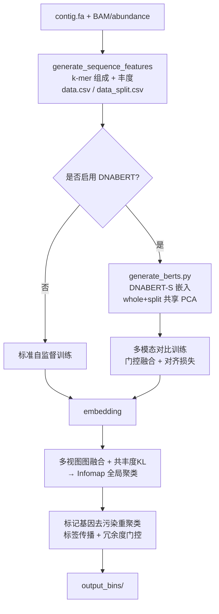

# Multimodal SemiBin — 融合 DNABERT 的多模态宏基因组分箱

[](https://opensource.org/licenses/MIT)

本项目是在 [SemiBin2](https://github.com/BigDataBiology/SemiBin)(v2.2.0)基础上扩展的宏基因组分箱(metagenomic binning)工具。
在保留 SemiBin2 自监督对比学习框架的同时,引入了**基因组语言模型(DNABERT-S)特征**、**多视图相似度图融合聚类**,以及**基于单拷贝标记基因的标签传播去污染重聚类**,目标是在短读长数据上获得更高质量的 MAGs(completeness↑ / contamination↓)。

> 本工具派生自 SemiBin / SemiBin2(MIT License)。核心的 k-mer 组成特征、丰度计算、自监督/半监督训练框架与长读长 DBSCAN 集成算法均来自上游;本仓库的贡献是下文"核心特性"列出的部分。请同时引用上游论文(见文末)。

---

## 目录
- [核心特性(相对 SemiBin2 的不同)](#核心特性相对-semibin2-的不同)
- [整体流程](#整体流程)
- [安装](#安装)
- [快速开始](#快速开始)
- [DNABERT 多模态用法](#dnabert-多模态用法)
- [新增命令行参数](#新增命令行参数)
- [输出说明](#输出说明)
- [致谢与引用](#致谢与引用)
- [许可证](#许可证)

---

## 核心特性(相对 SemiBin2 的不同)

| 模块 | 本项目 | 上游 SemiBin2 |
|---|---|---|
| **多模态嵌入模型** `multimodal_model.py` | 组成 / 丰度 / DNABERT 三分支编码 + **学习式 softmax 门控融合** + **跨模态对齐损失**(向 DNABERT 单向对齐,stop-gradient) | 单一编码器,仅 k-mer + 丰度 |
| **初始聚类建图** `graph_fusion.py` + `cluster.py` | 对 embedding / 组成 / 丰度 /(可选)DNABERT 各建 kNN 相似度图,**加权融合**后跑 Infomap;融合权重与核函数可配置,并**重新引入共丰度 KL 散度信号** | embedding∩k-mer 取交集 × KL 深度矩阵 → Infomap |
| **去污染重聚类** `marker_refinement.py` | 在污染 bin 内做**带种子的标签传播**(personalized-PageRank,α 自适应、长度加权扩散、置信度边际剔除边界 contig),仅当**标记基因冗余度下降**才接受拆分 | 用单拷贝标记基因种子初始化 KMeans,无条件拆分 |
| **DNABERT 特征提取** `generate_berts.py` | 批量推理 + 掩码均值池化;whole 与 split **共享同一个 PCA basis** | 无(SemiBin2 不使用基因组语言模型) |

新增的命令行开关见 [新增命令行参数](#新增命令行参数)。

## 整体流程



## 安装

运行环境:Python 3.7–3.13。

**1) 外部依赖**(与 SemiBin2 相同):

```bash
conda install -c bioconda bedtools hmmer samtools
# 可选: mmseqs2 (semi 模式), prodigal (ORF)
```

**2) 安装本项目**:

```bash
git clone https://github.com/dengdengf/test_bin.git
cd test_bin
pip install .
```

安装后提供命令 `SemiBin2`(以及向后兼容的 `SemiBin`)。

**3) DNABERT 多模态额外依赖**(仅在使用 DNABERT 功能时需要):

```bash
pip install "transformers>=4.30" biopython tqdm
```

并需要单独获取 **DNABERT-S 预训练模型**(权重文件较大,已在 `.gitignore` 中排除,不随仓库分发)。
将模型目录(含 `config.json`、`pytorch_model.bin` 等)放到 `SemiBin/DNABERT-S/`,或在运行时用 `--dnabert-model` 指定其路径。模型可从其官方来源获取:[DNABERT-S](https://github.com/MAGICS-LAB/DNABERT_S)。

## 快速开始

> 不使用 DNABERT 时,用法与 SemiBin2 完全一致。

单样本分箱:

```bash
SemiBin2 single_easy_bin \
    -i contig.fa \
    -b sample.sorted.bam \
    -o output \
    --disable-multimodal-training      # 不用 DNABERT,走标准自监督
```

多样本分箱(contig 名形如 `S1:contig_1`):

```bash
SemiBin2 multi_easy_bin -i concatenated.fa -b *.sorted.bam -o output --disable-multimodal-training
```

长读长(沿用上游 DBSCAN 集成算法):

```bash
SemiBin2 single_easy_bin -i contig.fa -b sample.sorted.bam -o output --sequencing-type=long_read
```

调节本项目新增的聚类行为(可加到上面的命令里):

```bash
SemiBin2 single_easy_bin -i contig.fa -b sample.sorted.bam -o output \
    --knn-kernel local \                       # 自调节局部核(替代全局 median 带宽)
    --fusion-weights 0.6 0.25 0.15 \           # 无 DNABERT 时:embedding/组成/丰度 权重
    --no-coabundance-kl                        # (可选)关闭共丰度 KL 调制做消融
```

## DNABERT 多模态用法

DNABERT 嵌入由 `generate_berts.py` 产生。它需要 **whole** 与 **split** 两份序列:
- whole = 与 `data.csv` 对应的原始 contig;
- split = 与 `data_split.csv` 对应的半段序列(名称形如 `h_1` / `h_2`,见 `generate_kmer.py`)。

二者必须**共享同一个 PCA basis**(否则对比学习不可比),本脚本通过"在 whole 上 `fit`、对 split 用 `transform`"保证这一点。

```bash
python SemiBin/generate_berts.py \
    -md  /path/to/DNABERT-S \
    -fd  whole_contigs.fasta  -nd output/dnabert_contig_names.txt        -dd output/dnabert_embedding.npy \
    -sfd split_contigs.fasta  -snd output/dnabert_split_contig_names.txt -sdd output/dnabert_split_embedding.npy \
    --batch_size 8
```

**对齐要求**(训练时 `load_multimodal_embeddings` 会逐行校验,务必满足):
1. 输出文件名需为 `dnabert_embedding.npy` / `dnabert_split_embedding.npy`(及对应 names 文件),放在 `data.csv` 同目录;
2. whole fasta 的记录顺序要与 `data.csv` 行序一致;split fasta 要与 `data_split.csv` 行序一致。

嵌入就位后,训练阶段会在短读长模式下自动检测并启用多模态模型(`is_multimodal`),聚类阶段把 DNABERT 作为第 4 路视图加入图融合(默认权重 `0.45/0.15/0.15/0.25`,可用 `--fusion-weights-multimodal` 调整)。

> 注:`single_easy_bin` / `multi_easy_bin` 内置了一条自动调用 DNABERT 提取的便捷路径(`--dnabert-model`),但它从原始 contig fasta 读序列,无法找到 `h_1/h_2` 半段。**推荐用上面的 `generate_berts.py` 显式生成嵌入**。

## 新增命令行参数

DNABERT / 训练(作用于 `single_easy_bin`、`multi_easy_bin`):

| 参数 | 说明 | 默认 |
|---|---|---|
| `--dnabert-model PATH` | DNABERT 模型目录 | 内置 `SemiBin/DNABERT-S` |
| `--dnabert-python PATH` | 用于 DNABERT 提取的 Python 解释器(可用 `$SEMIBIN_DNABERT_PYTHON`) | 当前解释器 |
| `--disable-multimodal-training` | 关闭多模态训练,回退标准自监督 | 关 |

图融合 / 聚类(作用于 `single_easy_bin`、`multi_easy_bin`、`bin`):

| 参数 | 说明 | 默认 |
|---|---|---|
| `--knn-kernel {median,local}` | 距离→相似度核:全局 median 带宽 / 自调节局部缩放 | `median` |
| `--fusion-weights EMB COMP ABUND` | 无 DNABERT 时三视图融合权重 | `0.60 0.25 0.15` |
| `--fusion-weights-multimodal EMB COMP ABUND DNA` | 多模态四视图融合权重 | `0.45 0.15 0.15 0.25` |
| `--no-coabundance-kl` | 关闭多样本共丰度 KL 调制 | 关(即默认启用 KL) |

`generate_berts.py` 参数:`-md` 模型目录;`-fd/-nd/-dd` whole 的 fasta/names/npy;`-sfd/-snd/-sdd`(可选)split 的 fasta/names/npy;`--batch_size`(默认 8)、`--max_length`(默认 5000)、`--target_dim`(默认 128)。

## 输出说明

输出目录(默认 `output/`)包含:
1. 特征文件(`data.csv`、`data_split.csv`,以及 DNABERT 嵌入 `.npy`);
2. 训练好的模型(`model.pt`);
3. 分箱结果:默认在 `output_bins/`;若启用重聚类则为去污染后的结果;
4. `bins_info.tsv` / `contig_bins.tsv` 等信息表。

## 致谢与引用

本项目基于 **SemiBin / SemiBin2**(MIT License,© BigDataBiology)。若在论文中使用,请引用上游工作:

> Pan, S.; Zhu, C.; Zhao, XM.; Coelho, LP. *A deep siamese neural network improves metagenome-assembled genomes in microbiome datasets across different environments.* **Nat Commun** 13, 2326 (2022). https://doi.org/10.1038/s41467-022-29843-y

> Pan, S.; Zhao, XM; Coelho, LP. *SemiBin2: self-supervised contrastive learning leads to better MAGs for short- and long-read sequencing.* **Bioinformatics** 39 (Suppl_1), i21–i29 (2023). https://doi.org/10.1093/bioinformatics/btad209

若使用了 DNABERT 多模态特征,请同时引用 DNABERT-S 的相关工作。

## 许可证

MIT License(继承自 SemiBin;见 `pyproject.toml` 中的 `license = { text = "MIT" }` 声明)。
