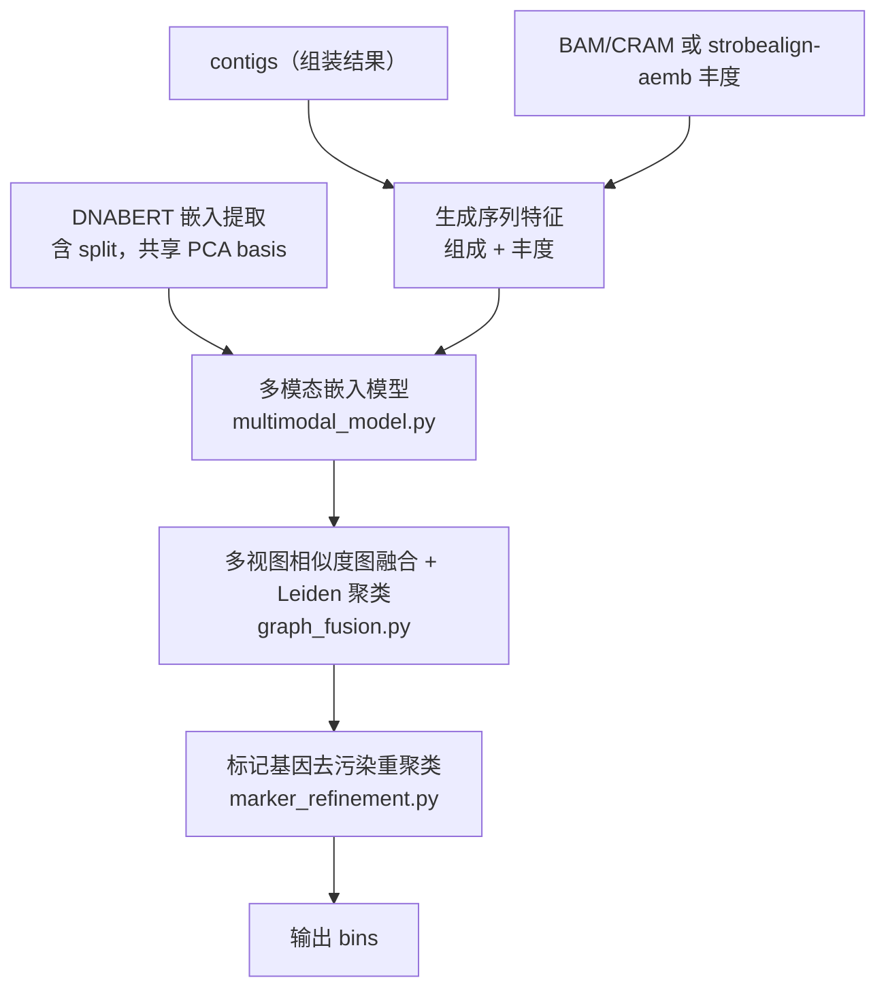

# MAGFuse

MAGFuse 是一个独立的多模态宏基因组分箱工具：在自监督对比学习与命令行接口的基础上，融合了多模态嵌入、多视图图融合聚类、标记基因去污染重聚类，以及 DNABERT 序列特征。

仓库：<https://github.com/dengdengf/test_bin>（分支 `main`）。MIT 许可。

## 核心特性

MAGFuse 的四点核心能力（仅描述以下能力）：

| 特性 | 说明 | 实现 |
| --- | --- | --- |
| 多模态嵌入模型 | 组成 / 丰度 / DNABERT 三分支编码 + 学习式 softmax 门控融合 + 跨模态对齐损失（向 DNABERT 单向对齐，使用 stop-gradient/detach）。短读长（`short_read`）训练路径默认且始终启用。 | `SemiBin/multimodal_model.py` |
| 多视图相似度图融合聚类 | 对 embedding/组成/丰度/DNABERT 各建 kNN 相似度图，加权融合后用 Leiden 做全局社区检测；融合权重与核函数可配置；多样本（非 combined）下逐边重新引入共丰度 KL 散度边权调制（省内存）。 | `SemiBin/graph_fusion.py` + `cluster.py` |
| 标记基因去污染重聚类 | 在被判为污染的 bin 内做带种子的标签传播（personalized-PageRank，α 随 bin 大小自适应、按 contig 长度加权扩散、用 top-2 置信度边际把边界 contig 留作未分配）；仅当单拷贝标记基因冗余度下降时才接受拆分。 | `SemiBin/marker_refinement.py` |
| DNABERT 特征提取 | 批量推理 + attention_mask 掩码均值池化；`single_easy_bin` / `multi_easy_bin` 自动提取 whole 与 split（`h_1`/`h_2` 由父 contig 自动切半），并共享同一个 PCA basis（在 whole 上 fit、对 split 用 transform），无需手动；`generate_berts.py` 是离线/单独生成嵌入的等价工具。 | `SemiBin/generate_berts.py` |

输入、预训练模型、长读长算法、k-mer 组成与丰度归一化等的详细说明见 [usage](usage.md) 与 [核心方法与特性](methods.md)。

## 整体流程



## 最简单的上手命令

若组装 contigs 在 `S1.fa`，对应已排序 BAM 为 `S1.sorted.bam`，使用预训练模型一条命令即可完成分箱：

```bash
MAGFuse single_easy_bin \
        --environment human_gut \
        -i S1.fa \
        -b S1.sorted.bam \
        -o output
```

可选的 `--environment` 预训练模型：`human_gut`、`dog_gut`、`ocean`、`soil`、`cat_gut`、`human_oral`、`mouse_gut`、`pig_gut`、`built_environment`、`wastewater`、`chicken_caecum`、`global`。

DNABERT 与图融合相关能力为默认流程的一部分，更多用法参见 [aemb / DNABERT 用法](aemb.md) 与 [子命令参数](subcommands.md)。安装好后即可使用 `MAGFuse` 命令。

## 文档导航

| 页面 | 内容 |
| --- | --- |
| [install](install.md) | 安装（源码安装、GPU、外部依赖） |
| [usage](usage.md) | 用法总览与单/多样本示例 |
| [methods](methods.md) | 核心方法与特性 |
| [generate](generate.md) | 如何生成输入（contigs、BAM 等） |
| [aemb](aemb.md) | strobealign-aemb 丰度与 DNABERT 特征 |
| [subcommands](subcommands.md) | 子命令与新增命令行参数 |
| [output](output.md) | 输出文件说明 |
| [training](training.md) | 模型训练（`train` / `train_self`） |
| [semi-supervised](semi-supervised.md) | 半监督方法说明 |
| [whatsnew](whatsnew.md) | 更新记录 |
| [faq](faq.md) | 常见问题 |
