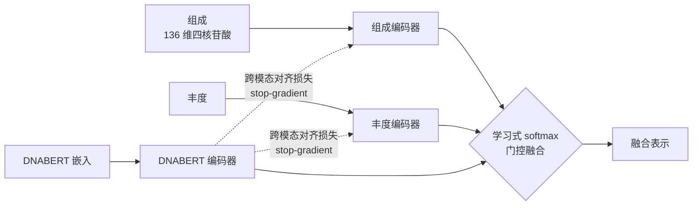

# 训练 SemiBin 模型

Multimodal SemiBin 沿用 SemiBin2 的机器学习思路：在分箱之前先从数据中学习（即 _训练_）出一个模型，再用该模型进行分箱。模型可以直接从将要被分箱的同一份数据中学习，这是最简单的做法，但并非唯一选择，本页将说明几种训练方式，并介绍本项目新增的**多模态训练**。

> 命令行入口为 `SemiBin2`（向后兼容 `SemiBin`）。相关页面：[usage.md](usage.md)、[generate.md](generate.md)、[semi-supervised.md](semi-supervised.md)、[subcommands.md](subcommands.md)。

## 单样本模型 vs 多样本模型

模型分为两类：

1. 单样本模型（single-sample）
2. 多样本模型（multi-sample）

顾名思义，单样本模型用于单样本分箱，多样本模型用于多样本分箱。多样本模型总是针对每个具体的分箱任务单独学习，而单样本模型可以从一个样本复用到下一个样本。当样本之间有一定相关性（_例如_来自同一生境）时复用效果最好，此时既能得到不错的结果，又能降低计算成本。

**模型一旦训练完成，与它是如何得到的无关**，单样本模型之间可以互换使用。

## 单样本模型的几种训练方式

最简单的方式是直接在将要应用模型的那个样本上训练。但这可能计算成本较高，因此也可以训练后复用：

- 如果你有一个包含多个相似样本（来自同一生境）的数据集，可以在其中一部分样本上训练，再把得到的模型逐个应用到每个样本。
- 注意，_一个单样本模型也可以从多个样本训练而来_。这里的关键在于：模型之所以是「单样本」，取决于它将被独立地应用到每个样本，而不取决于它是如何训练的。实践表明，使用多个样本来训练往往是有益的。

`--environment` 提供的预训练模型（如 `human_gut`、`dog_gut`、`ocean`、`soil`、`cat_gut`、`human_oral`、`mouse_gut`、`pig_gut`、`built_environment`、`wastewater`、`chicken_caecum`、`global`）均由多个样本训练而成，可直接用于推断而无需自行训练。

## 自监督学习 vs 半监督学习

SemiBin 最初（[Pan et al., Nat Commun 2022](https://doi.org/10.1038/s41467-022-29843-y)）提出的是半监督方法（SemiBin 由此得名）：对 contig 尽可能做分类学注释，再用这些分类标签来学习模型。详见 [semi-supervised.md](semi-supervised.md)。

后续版本支持 **自监督** 学习，这也是当前的默认模式：无需做分类学注释（注释通常是最耗时的一步），并且通常不需要多个样本即可学到较好的模型（[Pan et al., Bioinformatics 2023](https://doi.org/10.1093/bioinformatics/btad209)）。

对应的两个子命令：

| 子命令 | 学习方式 | 说明 |
| --- | --- | --- |
| `train_self` | 自监督 | 仅需序列特征（`data.csv` / `data_split.csv`），无需 cannot-link 约束 |
| `train` | 半监督 | 需要由 `generate_cannot_links` 产生的 cannot-link 约束 |

> 在 `single_easy_bin` / `multi_easy_bin` 一体化流程中，训练步骤会被自动调用，通常无需手动运行 `train_self` / `train`。手动训练主要用于自定义流程或复用模型的场景。

### 自监督训练示例

```bash
SemiBin2 train_self \
    --data data.csv \
    --data-split data_split.csv \
    --output output
```

### 半监督训练示例

```bash
SemiBin2 train \
    --data data.csv \
    --data-split data_split.csv \
    --cannot-link cannot.txt \
    --fasta contig.fasta \
    --output output
```

> 长读长（`--sequencing-type=long_read` 或 `bin_long`）沿用上游 DBSCAN 集成算法，本项目未对长读长路径做改动。

## 多模态训练

这是本项目相对 SemiBin2 的核心扩展之一。多模态训练在标准自监督训练的基础上，额外引入 **DNABERT 语言模型嵌入** 作为第三个模态，与「组成」「丰度」两个模态共同学习（见 `SemiBin/multimodal_model.py`）。

### 启用条件

多模态训练**仅在短读长（short_read）训练路径上启用**，并需要 DNABERT 嵌入文件预先就位：

- DNABERT 嵌入由 `SemiBin/generate_berts.py` 生成，需要 `whole` 与 `split` 两份，二者共享同一个 PCA basis（在 whole 上 `fit`、对 split 用 `transform`）。
- 输出文件名必须为 `dnabert_embedding.npy` 与 `dnabert_split_embedding.npy`，放在与 `data.csv` 相同的目录下；fasta 的行序必须与 `data.csv` / `data_split.csv` 一致（`load_multimodal_embeddings` 会逐行校验）。
- DNABERT-S 预训练权重较大，已被 gitignore、不随仓库分发，需单独获取后放到 `SemiBin/DNABERT-S/`，或用 `--dnabert-model` 指定路径。权重来源：[DNABERT_S](https://github.com/MAGICS-LAB/DNABERT_S)。

DNABERT 嵌入的详细生成方法见 [generate.md](generate.md) 与 [usage.md](usage.md)。推荐显式生成命令：

```bash
python SemiBin/generate_berts.py -md /path/DNABERT-S \
    -fd whole.fasta  -nd output/dnabert_contig_names.txt       -dd output/dnabert_embedding.npy \
    -sfd split.fasta -snd output/dnabert_split_contig_names.txt -sdd output/dnabert_split_embedding.npy
```

### 自动检测与关闭

在 `single_easy_bin` / `multi_easy_bin` 的短读长流程中，若检测到上述 DNABERT 嵌入文件就位，会**自动启用多模态模型**进行训练，无需额外开关。

如需关闭多模态、回退到标准自监督训练，使用：

```bash
--disable-multimodal-training
```

相关参数（用于 `single_easy_bin` / `multi_easy_bin`）：

| 参数 | 默认值 | 说明 |
| --- | --- | --- |
| `--dnabert-model PATH` | 内置 `SemiBin/DNABERT-S` 目录 | DNABERT-S 权重路径 |
| `--dnabert-python PATH` | `$SEMIBIN_DNABERT_PYTHON` 或当前解释器 | 运行 DNABERT 推理的 Python 解释器 |
| `--disable-multimodal-training` | 关闭多模态、回退标准自监督 |

> 提示：`single_easy_bin` / `multi_easy_bin` 内置的 DNABERT 自动提取路径对 `split` 半段有局限（原始 fasta 中没有 `h_1`/`h_2` 这类切分名称，见 `generate_kmer.py`），因此推荐用上面的 `generate_berts.py` 显式生成两份嵌入。

### 模型结构简述

多模态模型（`SemiBin/multimodal_model.py`）将三类输入分别编码后融合：



- **门控融合**：三个分支的表示通过一个学习式 softmax 门控加权融合，模型自行学习各模态的相对权重。
- **跨模态对齐损失**：组成 / 丰度分支向 DNABERT 分支做**单向对齐**，对 DNABERT 一侧使用 stop-gradient（`detach`），即只让组成 / 丰度去靠拢 DNABERT，而不反向扰动 DNABERT 表示。

训练完成后得到的模型与标准自监督模型用法一致，可直接传入后续的 `bin` 步骤。聚类阶段还可结合多视图图融合（见 [usage.md](usage.md) 中的 `--fusion-weights-multimodal` 等参数）。

## 致谢与引用

Multimodal SemiBin 派生自 [SemiBin / SemiBin2](https://github.com/BigDataBiology/SemiBin)（© BigDataBiology，MIT 许可）。如果使用本工具，请引用上游论文：

- Pan, S. _et al._ SemiBin. _Nat Commun_ **13**, 2326 (2022). <https://doi.org/10.1038/s41467-022-29843-y>
- Pan, S. _et al._ SemiBin2. _Bioinformatics_ **39**(Suppl_1): i21–i29 (2023). <https://doi.org/10.1093/bioinformatics/btad209>

如果使用了 DNABERT 多模态功能，请额外引用 [DNABERT-S](https://github.com/MAGICS-LAB/DNABERT_S)。
